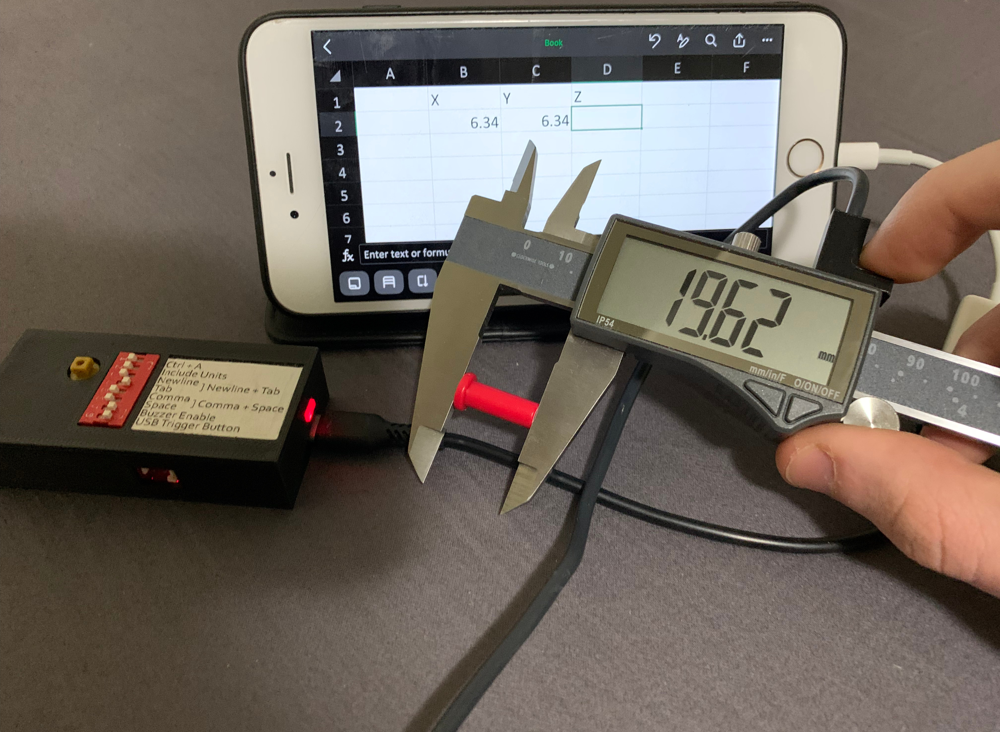
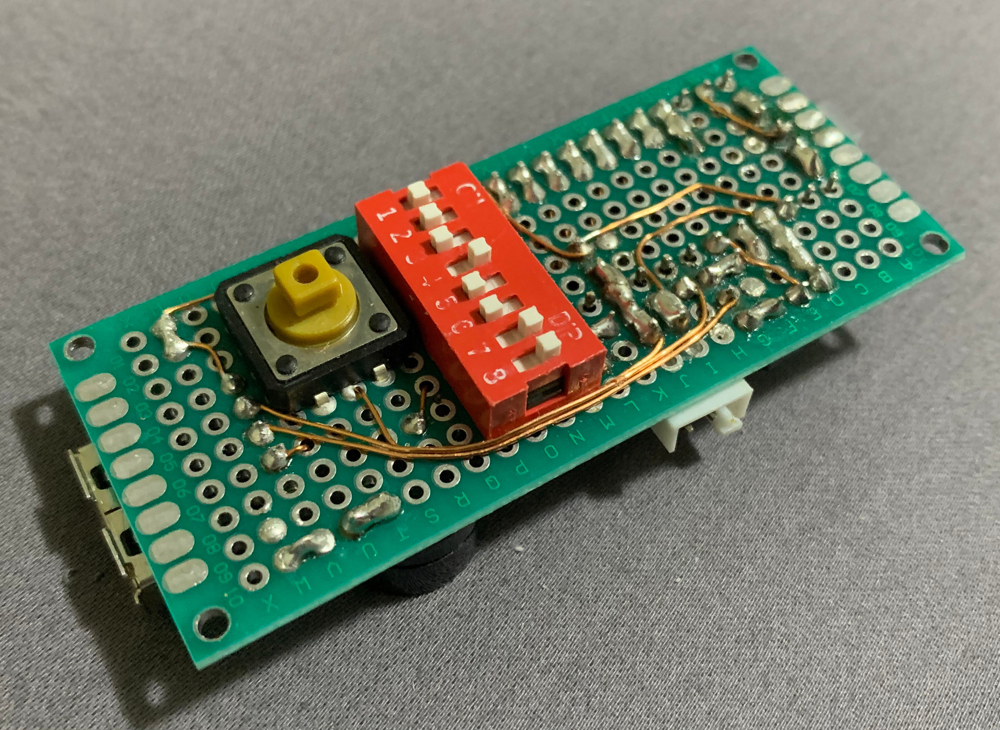
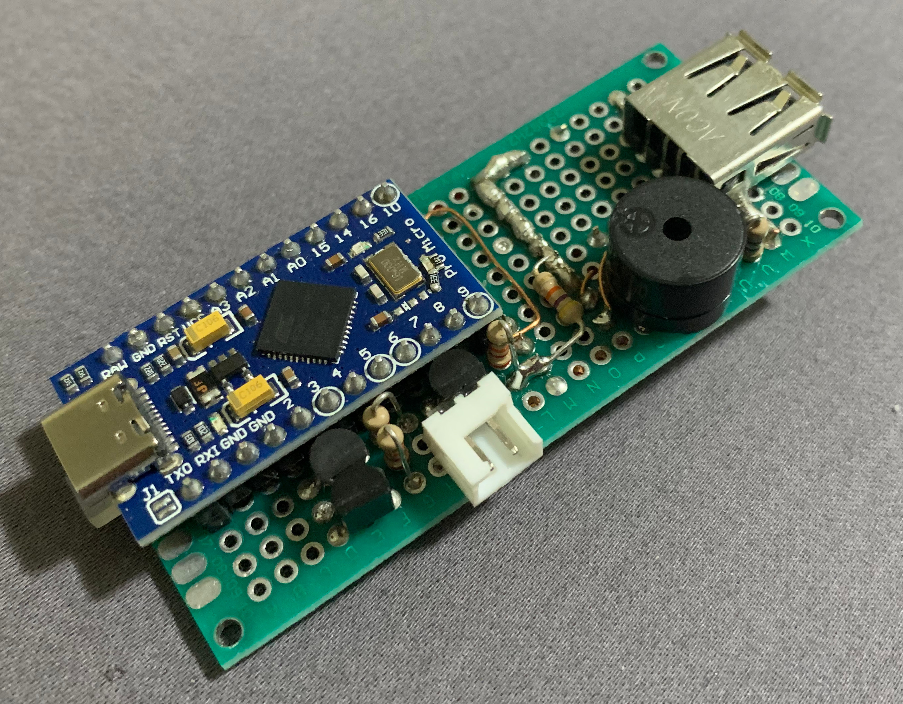
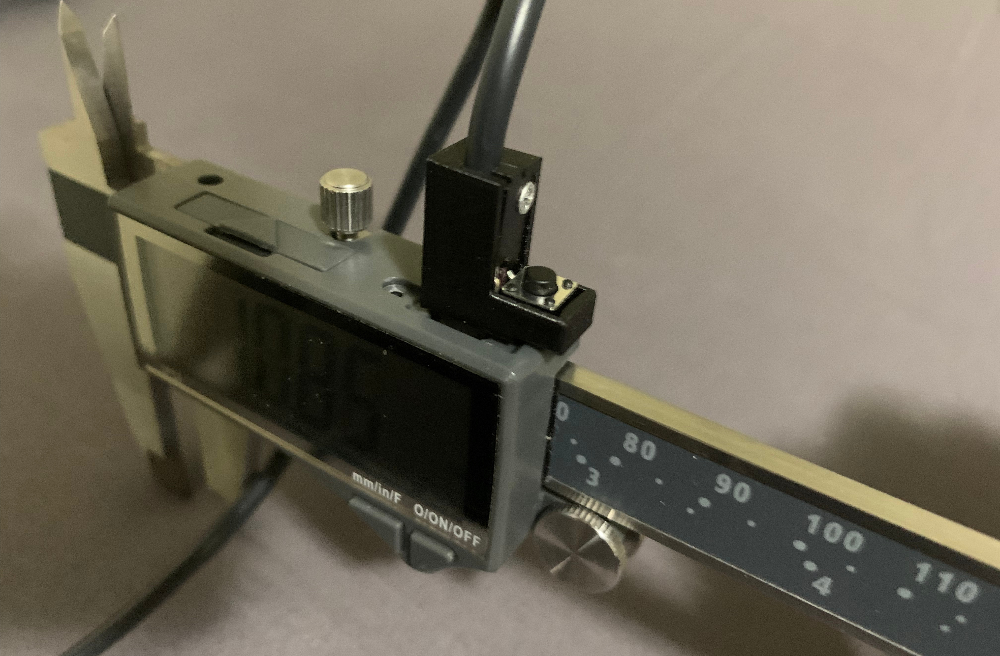

# Data Interface for Clockwise Tools Caliper Gauges

Easily transfer measurements from Clockwise Tools calipers to your computer for applications like measurement logging, CAD modeling, or manufacturing workflows.

This project is a reverse-engineered version of the Clockwise Tools DTCR-02 RS232 Data Cable for Clockwise tools DCLR-XX05 calipers.
And given the similarity to [liba2k's VINCA Reader](https://github.com/liba2k/VINCA_reader) it seems likely that this Data Interface will work with VINCA series calipers as well.

|  |
|:-:|
| *Data Interface connected to a iPhone running Excel.* |

## Table of Contents

- [Data Interface for Clockwise Tools Caliper Gauges](#data-interface-for-clockwise-tools-caliper-gauges)
  - [Table of Contents](#table-of-contents)
  - [Features](#features)
  - [Hardware](#hardware)
    - [Arduino Support](#arduino-support)
    - [PCB](#pcb)
    - [Case \& USB Cable](#case--usb-cable)
  - [Technical Information](#technical-information)
    - [The "RS232" Serial Protocol](#the-rs232-serial-protocol)
      - [Signal Details](#signal-details)
      - [Protocol Details](#protocol-details)
    - [Potential Improvements](#potential-improvements)
  - [Quirks](#quirks)
    - [iOS Devices](#ios-devices)
    - [Android Devices](#android-devices)

## Features

This project improves on the DTCR-02 Data Cable with enhanced features and flexibility:

- Emulates a generic USB keyboard, compatible with Linux, Windows, macOS, iOS[^1], Android[^1], and really anything that supports USB keyboards.
- Captures and transfers the caliper measurement to any program, such as Excel or CAD software.
- Multiple ways to trigger measurement transfer:
  - Built-in push button.
  - External remote push button or foot pedal (via a 2-pin JST connector).
  - Custom USB cable with a button near the calipers (see schematics for details).
- DIP switch configurable options:
  - `CTRL + A` to overwrite previous measurements.
  - Append units (mm/in) to measurements (e.g., 1.23&nbsp;mm).
  - Add newline, tab, comma, or space after measurements.
  - Enable a buzzer to provide audible feedback when a measurement is sent.
  - Enable the trigger input on the USB ports VBUS pin (see schematics for details).
- Open source allowing full customizability for advanced use cases.

[^1]: See [Quirks](#quirks) for compatibility notes.

## Hardware

|  |  |
|:-:|:-:|

### Arduino Support

Most Arduino's should be able to read the data stream from the calipers, as the clock rate is relatively slow.

However, in order to emulate a USB keyboard, the Arduino must support native USB communication (Micro, Pro Micro, Leonardo, etc.), or you must use something like [HoodLoader2](https://github.com/NicoHood/HoodLoader2) (See the [Arduino HID Project](https://github.com/NicoHood/HID) for compatibility).

### PCB

As part of the KiCad schematic, there is an example through-hole layout for a double-sided perfboard, as seen in the images above.

KiCad does not support making proper perfboard layouts, so the board is laid out as a PCB, but with components positioned on a 2.54&nbsp;mm grid.
If you intend fabricate an actual PCB, then you probably should not base it off of this.

### Case & USB Cable

3D models are also included for the case and the custom USB cable.
The case was designed to fit these [30x70&nbsp;mm perfboards](https://a.co/d/0OxZCzR) from Amazon, using the board layout provided in the schematic.

The USB cable was designed to fit a 6x6&nbsp;mm tactile push-button and a power only Micro-USB connector that I cut open to use the data pins.

> In both cases, you will likely have to make some modification to the 3D models to suit your own components.

|  |
|:-:|
| *Custom designed USB cable end with integrated trigger button* |

## Technical Information

### The "RS232" Serial Protocol

Clockwise Tools describes the communication as "RS232," but it uses synchronous serial communication over the USB D+ and D- pins. This is effectively equivalent to SPI.

#### Signal Details

- __Clock signal:__ USB D- pin, ~0.4&nbsp;ms per cycle, SPI Mode 3 equivalent.
- __Data signal:__ USB D+ pin, 24-bit (3 x 8-bit) packets, transmitted every ~150&nbsp;ms.
- __+1.5 V:__ USB VBUS pin, constant 1.5&nbsp;V supply.
- All pins operate at 1.5&nbsp;V.
- Clock and data are inverted due to the transistors used for level shifting. So SPI Mode 1 is used in software, and the serial data is inverted.
- Data is transmitted regardless of if the calipers are turned on or not.

> [!WARNING]
> The calipers exhibit weird behavior when too much current is drawn over the USB port.
> This can cause measurements to fluctuate significantly, or the screen to dim.
> Anything connected to the calipers USB port must not draw over __~0.3&nbsp;mA__ of current from all of its pins combined.
> This means that the parallel resistance between VBUS, D+, and D- to GND of the USB connector must be at least ~5&nbsp;kΩ, but preferably well above that.

As far as I can tell, there is no way to communicate from the host device to the calipers, as they are constantly transmitting on D+ and D-, and due to the above, pulling VBUS low causes the calipers to lose power.

#### Protocol Details

- First 4 bits are flags:
  - __Unit:__ Millimeters if 0, Inches if 1.
  - (Unknown use)
  - (Unknown use)
  - __Sign:__ Positive if 0, Negative if 1.
- Last 20 bits are fixed point measurement data:
  - In either hundredths of a millimeter, or
  - 1/2 thousandths of an inch.

The full details are laid out in this article: [Harbor Freight Caliper Data Format](https://www.yuriystoys.com/2013/07/chinese-caliper-data-format.html).

The calipers will send whatever unit is currently selected on the display.
Note that the fraction mode is sent exactly the same as inches.
However, it sends updates less often in fractions mode, presumably since it has to do additional processing for the fractional conversion.

The full implementation of decoding and converting the 24-bit packets can be seen in `ClockwiseCaliper.cpp`.

### Potential Improvements

I designed the schematics and built the device using parts that I had lying around.
Mostly used parts taken from laser printers, coffee makers, and power supplies.
So, given access to the right parts, there are some improvements that can be made to the design.

- The three transistors used to do the voltage level shifting (__Q1__, __Q2__, and __Q3__ in the schematic) should be replaced by MOSFETs.
  The resistors for those transistors should be changed to around 1&nbsp;kΩ.
  And pull-down resistors for the MOSFETs should be added, with values around 100&nbsp;kΩ. This is because of the maximum current requirement as outlined above.

- The calipers can not source over 0.3&nbsp;mA of current from all of its pins, however, I have not tested how much current (if any) it can sink.
  This may be the preferred method for connecting if it works.

- The program could technically use the hardware SPI interface of the Arduino.
  However, without proper timing of the slave select signal, it can cause the data to get out of sync on the first byte.
  This could be solved by controlling the SPI slave select input using another output pin.
  Then activating it on the initial clock pulse, and deactivating it on the last clock pulse.
  However, ensure that the slave select pin is accessible, as Arduino Pro Micro's use that pin for an onboard LED.

## Quirks

### iOS Devices

iOS devices will complain if the USB device reports that it draws more than 100&nbsp;mA over the USB port.
By default, most Arduino's report their bMaxPower USB configuration descriptor to be 500&nbsp;mA.

To change the bMaxPower descriptor you have to change the line `#define USB_CONFIG_POWER (500)` to be 100 or less in `USBCore.h` of the Arduino core files.

Note that for iDevices with a lightning port, a Lightning to USB Camera Adapter (the one with only a USB port) will allow connecting the device, so long as it reports a lower power consumption.

Instead, I have heard that the Lightning to USB 3 Camera Adapter (the one with both a USB port and a lightning port) MAY allow devices that report more than 100&nbsp;mA to work, so long as a charging cable is plugged in.

### Android Devices

I have not tested any Android devices with the Data Interface, but I would assume that with the right adapter, and potentially the iOS bMaxPower tweak above that it would work.
